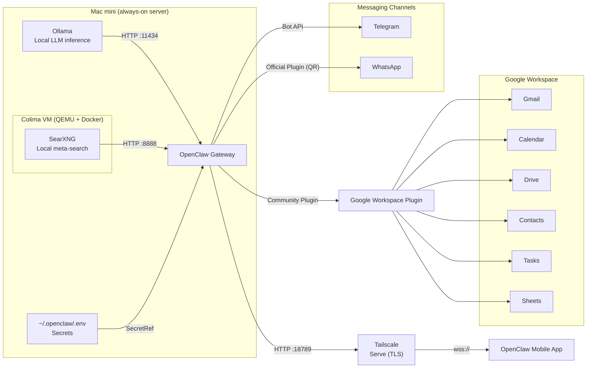

A Mac mini is not a toy. Even the base model can run 8B-parameter models at conversational speeds, host a persistent AI agent, and handle real work without sending a single byte to the cloud. Higher configurations push into 30B–70B territory. The catch is that getting there requires stitching together an inference engine and an agent platform that approaches autonomy in a very different way from a chatbot.

This article walks through the entire setup: configuring your Mac mini as an always-on server, installing Ollama with local models, running OpenClaw for messaging-first autonomous task execution, and adding private web search through a locally hosted SearXNG instance.

## Versions and Dependencies

This guide was written and tested against the following versions on **October 1, 2026**. Software moves fast, especially OpenClaw and its plugin ecosystem, so pin your expectations accordingly. Where a version matters, a note explains why.

### Host Environment

| Component | Version | Notes |
| --- | --- | --- |
| macOS | `27.0` (build `26A428`) | Server mode, auto-login enabled |
| Homebrew | `7.0.7` | Package manager for all CLI tools |
| Node.js | `26.10.0` | Node 22.22.3 is the minimum; Node 26 is recommended |
| npm | `11.19.1` | Ships with Node |

### Core Stack

| Component | Version | Notes |
| --- | --- | --- |
| OpenClaw | `2026.9.7 (c074824)` | Gateway runtime. This version satisfies the `>= 2026.9.7` requirement of the official SearXNG plugin. |
| Ollama | `0.34.4` | Local LLM inference on `127.0.0.1:11434` |
| Colima | `0.10.3` (commit `00f6c297`) | Headless Docker runtime for macOS, `aarch64` |
| colima-pulse | commit `309ec4f`, dated `2026-03-22` | LaunchDaemon manager for Colima at boot |
| Docker CLI | `29.8.2` | Client only; the daemon runs inside Colima |
| Docker Server | `29.5.2` | Reported by `docker info` inside the Colima VM |
| SearXNG (Docker image) | `searxng/searxng:latest` @ `sha256:a07a5cd2da2c63d66e559f9e4d3a3db106cfc6c32fb0ac70abe91cc28bcd7350` | Running build: `2026.9.30-a9d990033`, Python 3.14 inside the container, 377 MB |
| Tailscale | `1.102.5` (Homebrew **formula**) | Mesh VPN for the mobile app and remote access. Install with `--formula`, not `--cask`. |
| `yq` | `v4.54.1` (mikefarah) | Command-line YAML processor used to edit Colima config without an editor |

### Plugins

| Plugin | Registry name | Version | Notes |
| --- | --- | --- | --- |
| OpenClaw SearXNG plugin | `@openclaw/searxng-plugin` | `2026.9.7` | Official SearXNG plugin. Requires OpenClaw `>= 2026.9.7`; the runtime version in this guide meets that requirement. |
| OpenClaw WhatsApp plugin | `@openclaw/whatsapp` | `2026.9.7` | Official WhatsApp channel plugin. Installed but disabled by default; enable with `openclaw config set channels.whatsapp.enabled true`. |
| Google Workspace plugin | `@tensorfold/openclaw-google-workspace` | commit `498a680`, dated `2026-04-03` | Community plugin, installed from a local source checkout. Not published to npm with compiled output; see Part 9. |

### Compatibility Notes

*   **OpenClaw** `2026.9.7` **is the minimum for the official SearXNG plugin.** If you are pinned to an earlier release such as `2026.9.6`, the install command will fail with a plugin API version error. Either update OpenClaw with `openclaw update`, or use a community SearXNG plugin that targets the older API.
    
*   **Node.js 26 vs 22.** The article recommends Node 26 for faster gateway startup and lower memory use. Node 22.22.3 is the floor — OpenClaw refuses to start below it.
    
*   **SearXNG settings schema.** SearXNG validates its `settings.yml` against a schema on startup. The template in Part 8, Step 4 includes `use_default_settings`, `server.secret_key`, `search.formats`, and `doi_resolvers` because each of these is required by the current SearXNG schema. Older tutorials omit some of them and fail on newer releases.
    

> **Note:** If you are reading this months after publication, check `openclaw --version` and `openclaw plugins list` first. The plugin API moves faster than the core runtime, and the registry may have newer versions than what is documented here.

## Architecture Overview

The diagram below shows how all the pieces fit together. Everything inside the dashed border runs on your Mac mini. External services (Telegram, WhatsApp, Google Workspace) are reached over the network.



**How to read it:**

*   **Ollama** serves local models on `localhost:11434`. OpenClaw talks to it over HTTP.
    
*   **Colima** runs a lightweight Linux VM that hosts the Docker daemon. It starts at boot via a system LaunchDaemon, before any user logs in.
    
*   **SearXNG** runs inside the Colima VM as a Docker container. OpenClaw queries it on `localhost:8888`. Queries never leave your network.
    
*   **OpenClaw Gateway** is the central agent runtime. It reads secrets from `~/.openclaw/.env` via SecretRefs.
    
*   **Telegram** is reached through the Bot API using the token stored in `.env`.
    
*   **WhatsApp** is reached through the official `@openclaw/whatsapp` plugin, which pairs via QR code, and uses `allowFrom` from `.env` to restrict senders.
    
*   **Tailscale Serve** provides the encrypted HTTPS endpoint that the OpenClaw mobile app connects to. The gateway itself stays bound to loopback; only the tailnet can reach it.
    
*   **Google Workspace Plugin** bridges OpenClaw to Gmail, Calendar, Drive, Contacts, Tasks, and Sheets. Credential and token paths are stored in `.env`.
    

> **Note:** The diagram is illustrative. The key point is that all core components—Ollama, Colima, SearXNG, OpenClaw, Tailscale, and the secrets file—live on the Mac mini.

## Part 1: Configure Your Mac Mini as a Server

Before installing any AI tools, you need to make the Mac mini behave like a server. This means three things: it must never sleep, it must log in automatically after a reboot, and it must be reachable remotely.

### Enable Remote Login (SSH)

Open **System Settings → General → Sharing** and toggle **Remote Login** on. Alternatively, run this in Terminal:

```bash
sudo systemsetup -setremotelogin on
```

Verify it is running:

```bash
sudo systemsetup -getremotelogin
```

Once enabled, you can SSH into the machine from any computer on the same network:

```bash
ssh yourusername@your-mac-mini.local
```

### Prevent the Mac from Sleeping

A Mac mini that sleeps drops every attached session and stops every agent. Disable system sleep entirely:

```bash
sudo pmset -a sleep 0 disksleep 0 displaysleep 0
```

Also disable standby, auto power-off, and Power Nap:

```bash
sudo pmset -a standby 0 autopoweroff 0 powernap 0 hibernatemode 0
```

Verify the settings:

```bash
pmset -g
```

You should see `sleep 0` and `disksleep 0` in the output.

If you want to keep the display off while the system stays awake, use `caffeinate`:

```bash
caffeinate -i -s &
```

### Enable Automatic Login

For the machine to recover from an unattended reboot, it must log in automatically. Go to **System Settings → Users & Groups → Automatically log in as** and select your user account.

⚠️ **Note:** FileVault blocks automatic login. If FileVault is enabled, you must either disable it or accept that the machine will require a manual password after a reboot.

## Part 2: Install the Latest Node.js

OpenClaw requires **Node.js v22.22.3 or higher** — Node 26 is recommended as it starts the Gateway faster and uses less memory than Node 24. macOS does not ship with Node.js pre-installed.

### Check if Node.js Is Already Installed

```bash
node -v
```

If this returns `v22.22.3` or higher, you can skip to Part 3. If it returns `command not found`, continue below.

### Install Homebrew (if not already installed)

```bash
/bin/bash -c "$(curl -fsSL https://raw.githubusercontent.com/Homebrew/install/HEAD/install.sh)"
```

### Install Node.js via Homebrew

```bash
brew install node
```

Verify:

```bash
node -v
npm -v
```

### Alternative: Install via Node Version Manager (nvm)

```bash
curl -o- https://raw.githubusercontent.com/nvm-sh/nvm/v0.39.7/install.sh | bash
```

Restart your Terminal, then install Node 26:

```bash
nvm install 26
nvm use 26
nvm alias default 26
```

## Part 3: Install Ollama on Apple Silicon

Ollama is the bridge between your Mac mini's GPU and OpenClaw.

### Installation

```bash
brew install ollama
```

Or use the official install script:

```bash
curl -fsSL https://ollama.com/install.sh | sh
```

Verify:

```bash
ollama --version
```

### Run as a Background Service

```bash
brew services start ollama
```

By default, Ollama listens on `127.0.0.1:11434`.

### Configuration for Agent Work

```bash
launchctl setenv OLLAMA_NUM_PARALLEL 2
launchctl setenv OLLAMA_NUM_CTX 32768
launchctl setenv OLLAMA_KEEP_ALIVE 30m
```

## Part 4: What Your Mac Mini Can Run

On Apple Silicon, the GPU uses unified memory, but macOS reserves a portion. As a rule of thumb, plan for **60–75% of your total RAM** to be available for models.

### Quick Reference

| Model Size | Memory Needed (4-bit) |
| --- | --- |
| 7–8B | ~5–6 GB |
| 13–14B | ~9–10 GB |
| 30–32B | ~20 GB |
| 70B | ~40–48 GB |

These figures are for **weights only**. Add 4–8GB of headroom for the KV cache and runtime overhead.

### Recommended Models by Memory Tier

**16GB unified memory** — Comfortable for 7B–8B models.

| Model | Size | Use Case |
| --- | --- | --- |
| **Qwen 3.5 9B** | 6.6 GB | Best all-rounder, strong tool calling |
| **Granite 4.1 8B** | 5.7 GB | Efficient, high benchmark score for its size |
| **Ornith-1.0-9B** | 5.6 GB | State-of-the-art coding agent for its size |

```bash
ollama pull qwen3.5:9b
ollama pull granite4.1:8b
ollama pull ornith:9b
```

**24GB–32GB unified memory** — 12B–14B models become daily drivers.

| Model | Size | Use Case |
| --- | --- | --- |
| **Gemma 4 26B** | ~17 GB | Strong multimodal reasoning, 82.6% MMLU Pro |
| **Qwen 3.6 27B** | ~17 GB | Excellent general agent, 256K context |
| **DeepSeek R1 Distill 14B** | ~9 GB | Chain-of-thought reasoning |

```bash
ollama pull gemma4:26b
ollama pull qwen3.6:27b
```

**48GB unified memory** — The sweet spot. 30B–32B models run comfortably.

| Model | Size | Use Case |
| --- | --- | --- |
| **Qwen 3.6 35B-A3B** | ~28 GB | Fast MoE, 68.2 tok/s |
| **Qwen 2.5 Coder 32B** | ~20 GB | Dedicated coding model |
| **Gemma 4 31B** | ~18 GB | Dense model, 85.2% MMLU Pro |

```bash
ollama pull qwen3.6:35b-a3b
ollama pull qwen2.5-coder:32b
```

**64GB unified memory** — 70B models at 4-bit become feasible.

```bash
ollama pull llama3.3:70b
```

## Part 5: Install OpenClaw

OpenClaw is an open-source, self-hosted AI agent platform that connects large language models to messaging channels. It runs as a persistent gateway daemon on your Mac. Unlike chatbots that wait for you to type, OpenClaw acts proactively via a **heartbeat system** that checks for pending tasks every 30 minutes.

### Installation

```bash
npm install -g openclaw
```

Verify:

```bash
openclaw --version
```

### First-Run Configuration

```bash
openclaw onboard --install-daemon
```

This wizard guides you through setting up your first agent, connecting an LLM provider, and configuring at least one messaging channel.

### Secrets: the `~/.openclaw/.env` File

OpenClaw has a dedicated, trusted secrets file at `~/.openclaw/.env`. It is loaded automatically on gateway startup, so any variable you put there is available to `openclaw.json` via `${VAR}` substitution or a `--ref-source env` SecretRef.

Create the file if it doesn't exist:

```bash
mkdir -p ~/.openclaw
touch ~/.openclaw/.env
chmod 600 ~/.openclaw/.env
```

Add secrets one per line:

```bash
# ~/.openclaw/.env
# Ollama doesn't require a real key, but OpenClaw expects an opt-in marker.
OLLAMA_API_KEY=ollama-local
TELEGRAM_BOT_TOKEN=123456:ABC-DEF1234ghIkl-zyx57W2v1u123ew11
# Note: If you need to allow multiple numbers, store them comma-separated in the
# environment variable (e.g., +15555550123,+447700900123). The CSV-to-array
# conversion is handled automatically by OpenClaw.
OPENCLAW_WHATSAPP_ALLOW_FROM=+15555550123
SEARXNG_BASE_URL=http://localhost:8888
GOOGLE_WORKSPACE_CREDENTIALS_PATH=./secrets/google-oauth.json
GOOGLE_WORKSPACE_TOKEN_PATH=./secrets/google-tokens.json
```

> **Note:** Native OpenClaw channels use their own variable names: `TELEGRAM_BOT_TOKEN` for Telegram, and `OPENCLAW_WHATSAPP_ALLOW_FROM` for WhatsApp. Plugin-specific variables, like `SEARXNG_BASE_URL` and `GOOGLE_WORKSPACE_CREDENTIALS_PATH`, follow their plugin's own naming convention. You can add as many as you need, one per line.

### Connecting to Ollama

OpenClaw talks to Ollama's native API, not the OpenAI-compatible `/v1` endpoint. The cleanest way to wire them together is via the `openclaw config` CLI and a SecretRef pointing at `~/.openclaw/.env`.

**Step 1: Store the Ollama API key marker in** `.env`

Local Ollama doesn't need a real API key, but OpenClaw still expects one as an opt-in marker. Add it to the secrets file (see the section above) rather than exporting it in your shell:

```bash
echo 'OLLAMA_API_KEY=ollama-local' >> ~/.openclaw/.env
```

Because this writes to `.env`, the gateway needs a restart to pick it up. If the gateway is not yet running, this happens naturally when you start it.

**Step 2: Bind the key to the provider via CLI**

Point the provider's `apiKey` field at that environment variable:

```bash
openclaw config set models.providers.ollama.apiKey \
  --ref-provider default \
  --ref-source env \
  --ref-id OLLAMA_API_KEY
```

This change applies live. No restart needed.

**Step 3: Set the base URL (only if not using the default)**

> **Important:** If Ollama is running on the same machine as the OpenClaw Gateway, OpenClaw auto-discovers it at `http://127.0.0.1:11434`. You can skip this step.

For a remote Ollama host, set an explicit base URL. Do **not** add `/v1` — that selects OpenAI-compatible mode, where tool calling is not reliable:

```bash
openclaw config set models.providers.ollama.baseUrl "http://ollama-host:11434"
```

For a LAN host, use its `.local` name or IP:

```bash
openclaw config set models.providers.ollama.baseUrl "http://gpu-box.local:11434"
```

**Step 4: Verify the connection**

First, confirm Ollama itself is reachable from the Gateway host:

```bash
curl http://localhost:11434/api/tags
```

You should get a JSON list of installed models. If this hangs or refuses connection, Ollama isn't running or isn't listening on that port.

Next, ask OpenClaw to probe the provider end-to-end:

```bash
openclaw gateway status --deep
```

The `--deep` flag runs a deeper health check that includes provider connectivity. If the Ollama provider is listed as healthy, your config is wired correctly.

Finally, confirm OpenClaw can see your models:

```bash
openclaw models list --provider ollama
```

If this returns your pulled models (e.g., `qwen3.6:27b`), the integration is working.

**Step 5: Select a default model**

Once discovery works, pick a default model for your agent:

```bash
openclaw models set ollama/gemma4
```

Replace `gemma4` with the exact model name from `ollama list` or `openclaw models list --provider ollama`.

### When You Actually Need to Restart the Gateway

OpenClaw's default hot-reload picks up config changes as you make them. Most `openclaw config set` commands print a message like:

> *"Updated channels.whatsapp.enabled. Change will apply without restarting the gateway."*

That means the change is live. You do **not** need to restart.

A restart is only required in these cases:

*   **You edited** `~/.openclaw/.env`**.** The environment file is read once at process startup. Any new or changed variable needs a restart to take effect.
    
*   **You installed, updated, or removed a plugin.** New code has to be loaded into the running process.
    
*   **A config key is flagged** `restart-required`**.** The CLI will tell you when this is the case.
    
*   **You are troubleshooting a stuck pairing or authorization state.** A clean restart clears transient state.
    

Use `restart` rather than `stop` + `start`, and rather than a bare `openclaw gateway` (which errors if the gateway is already running):

```bash
# Basic restart
openclaw gateway restart

# Graceful restart (waits up to 5 minutes for active work to finish)
openclaw gateway restart --safe

# Immediate restart (no waiting)
openclaw gateway restart --force
```

Verify after restart:

```bash
openclaw gateway status
openclaw channels status --probe
openclaw logs --follow
```

## Part 6: Configure WhatsApp and Telegram

Both channels are configured via `openclaw.json` (at `~/.openclaw/openclaw.json`) and the `openclaw config` CLI. Changes hot-reload — no restart required. Telegram is the simplest to set up; WhatsApp requires QR code pairing.

### Telegram: Where to Find the Token

The bot token comes from **@BotFather**, Telegram's official bot creation tool.

1.  Open Telegram (mobile or desktop) and search for **@BotFather**. Confirm the handle is exactly `@BotFather` — there are impersonator accounts.
    
2.  Send `/newbot` and follow the prompts. You'll be asked for a bot name (display name) and a username (must end in `bot`, e.g., `my_openclaw_bot`).
    
3.  BotFather replies with a token that looks like `123456:ABC-DEF1234ghIkl-zyx57W2v1u123ew11`. Copy it.
    

### Telegram: Store the Token as a Secret

Never paste the bot token directly into `openclaw.json`. Instead, save it to OpenClaw's dedicated secrets file:

```bash
# Add the token to ~/.openclaw/.env (create it if needed)
mkdir -p ~/.openclaw
touch ~/.openclaw/.env
chmod 600 ~/.openclaw/.env

# Append the variable (replace with your real token)
echo 'TELEGRAM_BOT_TOKEN=123456:ABC-DEF1234ghIkl-zyx57W2v1u123ew11' >> ~/.openclaw/.env
```

> **Note:** Because this writes to `.env`, the gateway needs a restart to read the new value. If the gateway is not yet running, this happens naturally when you start it.

### Telegram: Configure the Channel via CLI

Now bind the channel to that secret using `openclaw config`. This writes a **SecretRef** into `openclaw.json` so the actual token never appears in the config file.

```bash
# 1. Enable the Telegram channel and set the DM policy
openclaw config set channels.telegram.enabled true
openclaw config set channels.telegram.dmPolicy "pairing"

# 2. Securely bind the bot token to the environment variable
openclaw config set channels.telegram.botToken \
  --ref-provider default \
  --ref-source env \
  --ref-id TELEGRAM_BOT_TOKEN
```

Each command prints a confirmation. If it says the change will apply without a restart, no restart is needed.

After running these commands, `openclaw.json` will contain a reference object for `botToken` instead of the raw token — something like:

```json
{
  "channels": {
    "telegram": {
      "enabled": true,
      "botToken": {
        "provider": "default",
        "source": "env",
        "id": "TELEGRAM_BOT_TOKEN"
      },
      "dmPolicy": "pairing"
    }
  }
}
```

You can verify the result with:

```bash
openclaw config get channels.telegram
```

### Telegram: Approve Your First DM

Telegram does not use `openclaw channels login telegram` — the token goes directly into config (as a SecretRef) or environment. If you just edited `.env`, restart once to load the token. If you have not started the gateway yet, start it now.

Send any message (e.g., "hello" or `/start`) to your bot from Telegram. This creates a pairing request. Then:

```bash
# 1. List pending requests
openclaw pairing list telegram

# 2. Approve the request using the code from the list
openclaw pairing approve telegram <CODE>
```

Add `--notify` to tell the requester on Telegram that they've been approved. Pairing codes expire after 1 hour — if a code expires, just send another message to the bot to generate a new one.

### Telegram: Re-Pairing

If you need to re-pair — for example, after switching Telegram accounts or resetting the bot — the flow is the same as first pairing: send a new message to the bot, list pending requests, and approve the new code.

If pairing state appears corrupted (the bot ignores all messages, or you're stuck in a loop), clear the state and try again:

```bash
openclaw gateway stop
rm ~/.openclaw/credentials/telegram-pairing.json
rm ~/.openclaw/credentials/telegram-allowFrom.json
openclaw gateway restart
```

Then send a new message to your bot and approve the fresh code.

### WhatsApp: Install the Official Plugin

OpenClaw's WhatsApp support ships as a separate plugin, `@openclaw/whatsapp`, distributed outside the core OpenClaw npm package so WhatsApp-specific runtime dependencies stay isolated.

If you've already run `openclaw onboard` or `openclaw channels add --channel whatsapp`, the plugin installation is prompted automatically. You can also install it manually:

```bash
openclaw plugins install @openclaw/whatsapp
```

Because a plugin install loads new code, the gateway needs a restart after this step.

```bash
openclaw gateway restart
```

Verify the plugin is loaded:

```bash
openclaw plugins list
```

### WhatsApp: How to Link Your Device

WhatsApp requires QR code pairing, exactly like WhatsApp Web. This uses one of your four linked device slots.

**Step 1: Run the channel login**

```bash
openclaw channels login --channel whatsapp
```

This displays a QR code in your terminal. Current WhatsApp login is QR-based only.

> **Warning:** Terminal-rendered QRs, screenshots, PDFs, or chat attachments can expire or become unreadable while being relayed from a remote machine. For remote or headless hosts, prefer a direct QR image handoff path over manual terminal capture.

**Step 2: Scan the QR code**

Open WhatsApp on your phone:

*   Go to **Settings → Linked Devices**
    
*   Tap **Link a Device**
    
*   Scan the QR code displayed in your terminal
    

**Step 3: Store your phone number as a secret**

The WhatsApp channel uses `allowFrom` to restrict which numbers can message the agent. Store your own number in `~/.openclaw/.env` so it never appears in `openclaw.json`:

```bash
echo 'OPENCLAW_WHATSAPP_ALLOW_FROM=+15555550123' >> ~/.openclaw/.env
```

Replace `+15555550123` with your phone number in E.164 format. Including your own number enables self-chat mode, where messages you send to yourself are treated as commands.

> **Note:** If you need to allow multiple numbers, store them comma-separated in the environment variable (e.g., `+15555550123,+447700900123`). The CSV-to-array conversion is handled automatically by OpenClaw. Do not wrap the value in quotes.

> **Note:** Because this writes to `.env`, the gateway needs a restart to read the new value. Do it now if the gateway is already running:

```bash
openclaw gateway restart
```

**Step 4: Configure WhatsApp via CLI**

Bind the channel to that secret using `openclaw config`:

```bash
# 1. Enable the WhatsApp channel and set the DM policy
openclaw config set channels.whatsapp.enabled true
openclaw config set channels.whatsapp.dmPolicy "pairing"

# 2. Securely bind the allowed numbers to the environment variable
openclaw config set channels.whatsapp.allowFrom \
  --ref-provider default \
  --ref-source env \
  --ref-id OPENCLAW_WHATSAPP_ALLOW_FROM
```

Verify:

```bash
openclaw config get channels.whatsapp
```

**Step 5: Approve your first DM**

How OpenClaw handles your first inbound message depends on which number you linked during QR pairing. There are two cases.

* * *

**Case A — Self-chat mode (you linked your own personal number)**

This is the most common first setup. You scanned the QR code with your personal WhatsApp, so OpenClaw is now linked to your own number, and you message *yourself*.

1.  Open WhatsApp on your phone.
    
2.  Tap the **new chat** icon and find **yourself**. WhatsApp labels this thread **"Message yourself"** — it's usually the first entry, or you can search your own name/number.
    
3.  Send any message ("hello", `/start`, or a period).
    
4.  Because your own number is **allowed by default when no other** `allowFrom` **entries are configured**, OpenClaw processes the message directly. **No pairing code is generated.**
    
5.  OpenClaw **never auto-pairs outbound messages you send from your own linked device to yourself**, so you will not see a code prompt here — that's expected.
    

If you don't get a reply, jump to the troubleshooting block below.

* * *

**Case B — Separate dedicated number (you linked a second number)**

Here, OpenClaw is linked to a *different* WhatsApp number, and you message it from your personal phone.

1.  Open WhatsApp on your personal phone.
    
2.  Tap the **new chat** icon and search for the **OpenClaw-linked number** (the one you scanned the QR code with). Save it as a contact if it helps.
    
3.  Send any message.
    
4.  OpenClaw sees an unknown sender, holds the message, and replies with an **8-character pairing code** (valid for 1 hour).
    
5.  Approve the code from your Mac mini terminal:
    
    ```bash
    openclaw pairing list whatsapp
    openclaw pairing approve whatsapp <CODE>
    ```
    
    Add `--notify` if you want the bot to send a confirmation back to the sender.
    

* * *

**Troubleshooting (both cases)**

If nothing happens after you send the message:

```bash
openclaw gateway status
openclaw config get channels.whatsapp
openclaw logs --follow
```

*   Confirm the gateway is running.
    
*   Verify the number is in **E.164 format** (e.g., `+15555550123`) and bound in config.
    
*   Watch the logs for inbound activity while you send the message.
    

Pending requests are **capped at 3 per channel** — additional requests are ignored until one expires or is approved.

**Testing outbound delivery from the CLI**

You can send a message from the terminal to test delivery:

```bash
openclaw message send --channel whatsapp --target +15551234567 --message hi
```

This sends an outbound message from the assistant. It **does not** create a pairing request — pairing only triggers on **inbound** messages from unknown senders.

**Step 6: Verify connectivity**

```bash
openclaw health
```

You should see WhatsApp listed as "connected."

### WhatsApp: Re-Pairing

If WhatsApp loses its link (for example, you removed the linked device from your phone, or the session expired), re-link it the same way you did originally:

```bash
openclaw channels login --channel whatsapp
```

Scan the new QR code from **Settings → Linked Devices → Link a Device**. Then restart the gateway:

```bash
openclaw gateway restart
```

If pairing state appears corrupted, clear it and re-link:

```bash
openclaw gateway stop
rm ~/.openclaw/credentials/whatsapp-pairing.json
rm ~/.openclaw/credentials/whatsapp-allowFrom.json
rm -rf ~/.openclaw/credentials/whatsapp-session/
openclaw gateway restart
```

Then run `openclaw channels login --channel whatsapp` again to scan a fresh QR code, and approve the new pairing code.

## Part 7: Connect from Anywhere with Tailscale

Everything up to this point assumes your Mac mini is reachable on the local network. To use the OpenClaw mobile app from outside your home — or even just from your phone on cellular — you need a private, encrypted path to the gateway. **Tailscale** provides that: a WireGuard-based mesh VPN that gives every device a stable address and an HTTPS endpoint without opening a single port on your router.

The gateway's built-in `gateway.tailscale.mode="serve"` setting tells OpenClaw to expose itself on your tailnet via Tailscale Serve. Your phone connects over the tailnet; OpenClaw never binds to a public interface.

### Prerequisites

**A Tailscale account** — sign up at [tailscale.com](https://tailscale.com). The free tier covers personal use.

**The Homebrew formula, not the GUI app.** The macOS app store version and the `--cask` install are sandboxed and cannot run the `tailscale serve` subcommand, which OpenClaw needs to publish itself on the tailnet. Install the CLI formula instead:

```bash
brew install --formula tailscale
```

### Step 1: Authenticate Your Mac Mini

Start the daemon and log in:

```bash
sudo brew services start tailscale
sudo tailscale up
```

A URL prints in your terminal. Open it in a browser and log in with your Tailscale account. Once authorized, verify the node is registered:

```bash
tailscale status
```

You should see your Mac mini listed with a `100.x.x.x` address and its MagicDNS name (e.g., `night-thoughts.tail305232.ts.net`).

### Step 2: Enable Tailscale Serve on the Gateway

Point OpenClaw at Tailscale Serve and restart so it picks up the change:

```bash
openclaw config set gateway.tailscale.mode "serve"
openclaw gateway restart
openclaw gateway status --deep
```

Look for these two lines in the status output:

```plaintext
Runtime: running
Connectivity probe: ok
```

And in the logs, OpenClaw will announce the HTTPS endpoint it configured:

```plaintext
gateway/tailscale serve enabled: https://night-thoughts.tail305232.ts.net/
```

> **Note:** OpenClaw requires `gateway.bind="loopback"` when `gateway.tailscale.mode="serve"`. Tailscale Serve is a reverse proxy: it terminates TLS and forwards traffic to `127.0.0.1:18789`. Do not change the bind setting.

### Step 3: Install Tailscale on Your Phone

The OpenClaw mobile app connects over the tailnet, so your phone must be on the same tailnet as the Mac mini.

*   **Android:** install **Tailscale** from the [Play Store](https://play.google.com/store/apps/details?id=com.tailscale.ipn).
    
*   **iOS:** install **Tailscale** from the [App Store](https://apps.apple.com/app/tailscale/id1470499037).
    

Open the app and sign in with the **same Tailscale account** you used on the Mac mini. Toggle the VPN switch on. Your Mac mini should appear in the machine list with a green dot.

> **Known Android quirk:** if the OpenClaw app later reports `Unable to resolve host`, open the Tailscale app on your phone, go to **Settings**, and turn off **"Use Tailscale DNS"**. This works around a MagicDNS resolution bug on some Android builds.

### Step 4: Pair the OpenClaw Mobile App

On the Mac mini, generate the pairing QR code:

```bash
openclaw qr
```

The output shows the gateway URL and a QR code. Note the `Gateway:` line — it should read `wss://<your-magicdns-name>`, not the old hostname.

Scan the QR code with the OpenClaw app on your phone (**Onboarding → Scan QR**). The app will submit a pairing request.

Approve it on the Mac mini:

```bash
openclaw devices list
openclaw devices approve <requestId>
```

Then verify the pairing:

```bash
openclaw nodes status
```

Your phone appears as a connected node. You can now chat with the agent from anywhere your phone has internet — no port forwarding, no dynamic DNS, no exposed attack surface.

### Fingerprint Verification

The OpenClaw mobile app uses TLS certificate pinning (Trust On First Use) to prevent man-in-the-middle attacks. On first connection, it asks for the SHA-256 fingerprint of the certificate Tailscale presents for your MagicDNS name.

Get it on the Mac mini:

```bash
tailscale cert night-thoughts.tail305232.ts.net
openssl x509 -in night-thoughts.tail305232.ts.net.crt -noout -fingerprint -sha256
```

Paste the hex value (with colons) into the app's fingerprint field. The app remembers it for future connections.

### Daily Operation

Tailscale runs as a background service and reconnects automatically after reboots. OpenClaw publishes the Serve route on every gateway start. Nothing to do — the tunnel comes up before you need it.

To confirm everything is healthy at any time:

```bash
tailscale status           # is this machine on the tailnet?
tailscale serve status     # is OpenClaw publishing itself?
openclaw gateway status    # is the gateway running?
```

## Part 8: Add Local Web Search with SearXNG on Colima

OpenClaw's `web_search` tool can be backed by **SearXNG**, a self-hosted meta-search engine. SearXNG aggregates results from Google, Bing, DuckDuckGo, and other engines, and returns them to OpenClaw over a local HTTP endpoint. Queries never leave your network, and there is no API key or per-query cost.

To run SearXNG on an always-on Mac mini, you need Docker that starts **before any user logs in**. Docker Desktop cannot do this — it requires a graphical login. The solution is **Colima**, a lightweight container runtime that runs a Linux VM via QEMU and can be managed by a system LaunchDaemon.

### Why Colima + colima-pulse

Docker Desktop on macOS is a GUI application. It does not start until a user logs in, which defeats the purpose of an always-on, headless server. Colima runs entirely from the command line, uses significantly less memory (~400 MB idle vs ~1.5 GB), and can be started at boot by a LaunchDaemon — **before** any user session exists.

`colima-pulse` is a small script that installs and manages that LaunchDaemon. It handles:

*   Starting Colima at boot, before login.
    
*   Waiting until Docker actually responds before continuing.
    
*   Recovering cleanly after a reboot or power loss.
    
*   Explicit-only reset (safe by default).
    

It uses **QEMU** rather than Apple's VZ framework because QEMU has proven more reliable for headless, pre-login startup.

### Prerequisites

**Admin rights** (for LaunchDaemon install) and **Homebrew** (already installed in Part 2). The script installs `colima`, `docker`, and `qemu` if they are missing.

> **FileVault warning:** If FileVault is enabled, macOS will not expose `/Users/...` until the disk is unlocked at the login screen. Containers may wait until the first unlock before starting. For fully unattended operation, **disable FileVault**. This is macOS behaviour, not a limitation of Colima.

### Step 1: Install Colima Pulse

Clone the repository:

```bash
cd ~
git clone https://github.com/MrCee/colima-pulse
cd colima-pulse
```

Copy the template and set `HOMEBREW_USER` to your macOS username:

```bash
cp .env.example .env
sed -i '' "s|^HOMEBREW_USER=.*|HOMEBREW_USER=$(whoami)|" .env
```

**Optional tuning:** The template ships with sensible defaults. Review the active settings:

```bash
grep -vE '^\s*#|^\s*$' .env
```

| Variable | Default | Notes |
| --- | --- | --- |
| `HOMEBREW_USER` | *(required)* | Must match a real macOS user with a valid home directory. |
| `COLIMA_PROFILE` | `default` | Colima profile name. |
| `COLIMA_RUNTIME` | `docker` | Must be `docker`. |
| `COLIMA_VM_TYPE` | `qemu` | Must be `qemu`. Chosen for headless reliability. |
| `COLIMA_CPUS` | `2` | vCPUs allocated to the Colima VM. |
| `COLIMA_MEMORY` | `2` | Memory in GB. Bump to `4` if SearXNG feels slow. |
| `COLIMA_DISK` | `20` | Disk in GB. |
| `CLEAN_OTHER_COLIMA_DAEMONS` | `prompt` | `prompt`, `true`, or `false`. |
| `COLIMA_START_FILTER_INFO` | `true` | Filter Colima start output. |

For example, to give the VM 4 GB of RAM:

```bash
echo 'COLIMA_MEMORY=4' >> .env
```

Then run the installer:

```bash
./colima-pulse.sh
```

The script stops any conflicting processes, starts Colima with QEMU and the Docker runtime, waits until Docker is actually usable, and installs a LaunchDaemon labelled `homebrew.mrcee.colima-pulse`.

Verify the LaunchDaemon is loaded:

```bash
sudo launchctl print system | grep -i colima
```

You should see the Colima Pulse service listed.

### Step 2: Verify Docker Works Headless

Confirm Colima is running and the Docker CLI can reach the daemon:

```bash
colima status
docker info
```

`colima status` should show `Running`. `docker info` should return the Docker daemon details without errors.

> **Note:** Colima uses two socket paths — the default `DOCKER_HOST` and Colima's own socket. The Colima context is set automatically. If `docker info` fails, check that `DOCKER_HOST` is not pointing at Docker Desktop's stale socket.

### Step 3: Harden Colima's Seccomp Profile

Colima's Docker daemon uses a seccomp profile that may block newer syscalls required by modern `runc` versions. This can cause container startup failures. The long-term fix is to install Docker's latest default seccomp profile and point Colima at it.

**Step 3a: Install** `yq`

The configuration change below uses `yq`, a command-line YAML processor, so the `colima.yaml` file can be updated without opening an editor:

```bash
brew install yq
```

Verify the Go-based version is installed:

```bash
yq --version
```

You should see output starting with `yq (https://github.com/mikefarah/yq/) version v4.`. The `v4` major version matters — the command syntax below uses v4 features.

> **Note:** Homebrew also has a package named `python-yq`, which is a different tool with incompatible syntax. If it was previously installed, remove it with `brew uninstall python-yq` to avoid a command-name conflict.

**Step 3b: Download the seccomp profile**

Download Docker's default seccomp profile:

```bash
curl -o /tmp/seccomp.json \
  https://raw.githubusercontent.com/moby/profiles/main/seccomp/default.json
```

Confirm the download is valid JSON and not an error page:

```bash
head -c 60 /tmp/seccomp.json
```

You should see `{ "defaultAction": "SCMP_ACT_ERRNO"`. If the output looks like HTML or an error message, the URL is wrong.

**Step 3c: Copy the profile into the Colima VM**

```bash
colima ssh -- sudo mkdir -p /etc/docker
colima ssh -- sudo tee /etc/docker/seccomp.json < /tmp/seccomp.json
```

**Step 3d: Point Colima's Docker daemon at the profile**

Use `yq` to write the `docker.seccomp-profile` setting directly into the Colima config, then restart Colima:

```bash
yq -i '.docker."seccomp-profile" = "/etc/docker/seccomp.json"' ~/.colima/default/colima.yaml && colima restart
```

This targets the **default** Colima profile. If you use a named profile, replace `default` in the path with your profile name.

**Step 3e: Verify the profile is active**

```bash
docker info | grep -i seccomp
```

The output should show the custom profile path.

> **Quick fix alternative:** If updating the profile is not feasible, set `seccomp-profile: "unconfined"` to disable syscall filtering. This reduces security and should only be used as a temporary workaround.

### Step 4: Create the SearXNG Configuration Directory

Create a directory on the host for the SearXNG settings file:

```bash
mkdir -p ~/searxng
```

Generate a random secret key and write `~/searxng/settings.yml`:

```bash
SECRET=$(openssl rand -hex 32)

cat > ~/searxng/settings.yml <<EOF
use_default_settings: true

server:
  secret_key: "${SECRET}"
  limiter: false
  public_instance: false

search:
  formats:
    - html
    - json

doi_resolvers:
  oadoi.org: "https://oadoi.org/"
  doi.org: "https://doi.org/"
default_doi_resolver: "oadoi.org"
EOF
```

> **Why** `use_default_settings: true` **matters:** SearXNG's default `settings.yml` contains the full list of search engines, categories, and other required internals. A custom settings file **replaces** the defaults entirely unless you explicitly tell SearXNG to merge them. Without this line, zero engines are enabled and every search returns an HTTP 500 error.

> **Why the secret key matters:** SearXNG validates its settings against a schema on startup. `server.secret_key` is required and must be a non-empty string. Without it, the worker process aborts with `ValueError: Invalid settings.yml` before the web server can bind.

> **Why the DOI resolvers matter:** Newer SearXNG versions expect a `doi_resolvers` map with a `default_doi_resolver`. Omitting it causes a `KeyError` crash on the first search request.

> **Why JSON matters:** SearXNG disables JSON output by default on new installs. Without `formats: [html, json]`, the OpenClaw plugin gets an HTML page instead of structured results, and search fails.

### Step 5: Run SearXNG with a Restart Policy

Stop and remove any previous container, then start the hardened one:

```bash
docker stop searxng 2>/dev/null; docker rm searxng 2>/dev/null

docker run -d \
  --restart unless-stopped \
  --name searxng \
  -p 127.0.0.1:8888:8080 \
  -v ~/searxng/settings.yml:/etc/searxng/settings.yml:ro \
  --read-only \
  --tmpfs /tmp:size=100m \
  --tmpfs /etc/ssl/certs:size=16m \
  --cap-drop=ALL \
  --security-opt=no-new-privileges \
  --memory=512m \
  --cpus=1.0 \
  searxng/searxng
```

**Why each flag matters:**

| Flag | Purpose |
| --- | --- |
| `--restart unless-stopped` | Container starts automatically when Colima/Docker starts or the Mac reboots. It stays stopped only if you manually stopped it. |
| `-p 127.0.0.1:8888:8080` | Binds to loopback only. SearXNG is not reachable from the LAN or the internet. Only processes on the Mac mini can query it. |
| `-v ~/searxng/settings.yml:/etc/searxng/settings.yml:ro` | Mounts your settings file read-only. JSON API stays enabled and the secret key persists across restarts. |
| `--read-only` | The container's root filesystem is mounted read-only. Prevents runtime writes to the image layer. |
| `--tmpfs /tmp:size=100m` | Provides a writable `/tmp` for SearXNG's cache, capped at 100 MB. |
| `--tmpfs /etc/ssl/certs:size=16m` | Gives the certificate updater a writable scratch space so it does not fail on the read-only root filesystem. |
| `--cap-drop=ALL` | Drops all Linux capabilities. SearXNG does not need any. |
| `--security-opt=no-new-privileges` | Prevents privilege escalation via setuid binaries inside the container. |
| `--memory=512m` | Caps container memory at 512 MB. Prevents a runaway SearXNG from starving the host. |
| `--cpus=1.0` | Caps the container at one CPU core. |

Verify it's up and returning JSON:

```bash
curl 'http://localhost:8888/search?q=test&format=json'
```

You should get a JSON object with a `results` array. If you get HTML back, the settings file isn't mounted correctly or JSON isn't enabled under `search.formats`.

### Step 6: Install the SearXNG Plugin

```bash
openclaw plugins install @openclaw/searxng-plugin
```

The official plugin requires OpenClaw `>= 2026.9.7`. If you are on an earlier version, the install will fail with a plugin API version error. Update OpenClaw first with `openclaw update`, or use a community alternative such as `openclaw-local-searxng-search`.

Because a plugin install loads new code, restart the gateway once:

```bash
openclaw gateway restart
```

Verify the plugin is loaded:

```bash
openclaw plugins list | grep searxng
```

You should see the SearXNG plugin listed as `enabled`. If it's missing, re-run the install command and check `openclaw logs --follow` for plugin loading errors.

### Step 7: Configure the Base URL

Add the SearXNG base URL to `~/.openclaw/.env` so the plugin can find your local instance:

```bash
echo 'SEARXNG_BASE_URL=http://localhost:8888' >> ~/.openclaw/.env
```

Do **not** wrap the value in quotes. Because this writes to `.env`, restart the gateway once to load it:

```bash
openclaw gateway restart
```

### Step 8: Select SearXNG as the Provider

OpenClaw will **not** automatically pick SearXNG over a higher-priority provider that already has credentials configured. You must explicitly select it:

```bash
openclaw config set tools.web.search.provider "searxng"
```

This change hot-reloads — no restart required. Alternatively, use the interactive setup wizard:

```bash
openclaw configure --section web
```

### Step 9: Configure the Plugin (Optional)

The plugin accepts optional category and language filters, and you can bind `baseUrl` to the environment variable with a SecretRef:

```bash
openclaw config set plugins.entries.searxng.config.webSearch.baseUrl \
  --ref-provider default \
  --ref-source env \
  --ref-id SEARXNG_BASE_URL

openclaw config set plugins.entries.searxng.config.webSearch.categories "general,news"
openclaw config set plugins.entries.searxng.config.webSearch.language "en"
```

These changes hot-reload. No restart required.

### Step 10: Verify

Verify the provider is selected and the plugin is loaded:

```bash
openclaw config get tools.web.search.provider
openclaw config get plugins.entries.searxng
```

Then test from any connected chat channel:

> Search the web for today's top technology news

The agent should invoke the `web_search` tool, query your local SearXNG instance, and return structured results with titles, URLs, and snippets.

### How SearXNG on Colima Works

*   **Transport:** OpenClaw calls SearXNG's native `format=json` endpoint. It is not doing HTML scraping.
    
*   **Network guard:** `http://` base URLs must target a trusted private or loopback host. Public hosts must use `https://`. Since `localhost` is a loopback address, your local setup passes this check.
    
*   **Auto-detection order:** SearXNG is checked **last** in auto-detection (order 200), after API-backed providers, DuckDuckGo, and Ollama Web Search. This is why Step 8's explicit `openclaw config set` is necessary — the auto-detector will not choose it for you if any other provider has credentials.
    
*   **No API key:** SearXNG works with any instance out of the box.
    
*   **Boot order:** Colima Pulse starts Colima before login. Docker starts. The `--restart unless-stopped` policy brings SearXNG up. By the time OpenClaw's gateway starts, SearXNG is already listening.
    

### Troubleshooting

If web search does not work:

```bash
colima status
docker ps
curl http://127.0.0.1:8888
openclaw gateway status
openclaw plugins list
openclaw logs --follow
```

*   Confirm Colima is running (`colima status` shows `Running`).
    
*   Confirm the SearXNG container is up (`docker ps` shows it as `Up`).
    
*   Confirm SearXNG responds to `curl`.
    
*   Confirm the gateway is running and the SearXNG plugin is listed as `enabled`.
    
*   Watch the logs while you trigger a search to see where the chain broke.
    

**Common SearXNG errors:**

| Symptom | Cause | Fix |
| --- | --- | --- |
| Container status `Restarting (1)` | Worker crashes on startup | Check `docker logs searxng` for the abort reason |
| `ValueError: Invalid settings.yml` | `server.secret_key` missing or empty | Add a generated key under `server:` |
| `can't create /etc/ssl/certs/ca-certificates.crt.new: Read-only file system` | `--read-only` blocks cert writes | Add `--tmpfs /etc/ssl/certs:size=16m` |
| HTTP 500 on every search | `use_default_settings: true` missing | Add it to the top of `settings.yml` |
| `KeyError: 'default_doi_resolver'` | `doi_resolvers` block missing | Add the block and restart |
| HTTP 403 on `format=json` | `json` not in `search.formats` | Ensure the list includes both `html` and `json` |

If the container is not running after a reboot, check the Colima Pulse LaunchDaemon:

```bash
sudo launchctl print system | grep -i colima
docker ps
```

If Colima is running but the container is stopped, check the container logs:

```bash
docker logs searxng
```

### Full Reset (If Needed)

If Colima or the container state becomes corrupted, colima-pulse provides an explicit reset path. Review the help first:

```bash
./colima-pulse.sh --help
```

A full reset with a backup move:

```bash
./colima-pulse.sh --full-reset --backup=move
```

This stops Colima, moves the existing state aside, and starts fresh.

## Part 9: Configure Gmail and Google Calendar

OpenClaw's Google Workspace integration is handled through the `@tensorfold/openclaw-google-workspace` plugin — one install, one OAuth flow, six services (Gmail, Calendar, Drive, Contacts, Tasks, Sheets).

> **Note:** Google also released a Workspace CLI (`gws`) in March 2026 that can integrate with OpenClaw. It is not an officially supported Google product and requires a different setup path. This article focuses on the community plugin for stability and broader service coverage.

### Step 1: Clone and Install the Plugin

The published npm package for this plugin currently ships **without compiled JavaScript output** — only TypeScript source. OpenClaw rejects installed plugins that point at `.ts` entry files without a corresponding `dist/` build. Installing from a **local source checkout** bypasses this restriction, because OpenClaw supports TypeScript source fallback for local development paths.

Clone the repository and install its runtime dependencies:

```bash
cd ~/Downloads
git clone https://github.com/tensorfold/openclaw-google-workspace.git
cd openclaw-google-workspace
npm install
```

Install the plugin from the local checkout using link mode. The `-l` flag avoids copying the directory and registers it in `plugins.load.paths`:

```bash
openclaw plugins install -l .
```

Because a plugin install loads new code, restart the gateway once:

```bash
openclaw gateway restart
```

Verify the plugin is loaded:

```bash
openclaw plugins list | grep openclaw-google-workspace
```

You should see `openclaw-google-workspace` listed as `enabled`. If it's missing, re-run the install command and check `openclaw logs --follow` for plugin loading errors.

### Step 2: Create a Google Cloud Project

This is the part that trips most people up. Here is the exact sequence:

**2a. Create the project**

*   Go to the [Google Cloud Console](https://console.cloud.google.com/)
    
*   Click the project dropdown at the top → **New Project**
    
*   Name it (e.g., `openclaw-workspace`) → **Create**
    
*   Select the new project from the dropdown
    

**2b. Enable the required APIs**

Go to **APIs & Services → Library** and enable each API you need:

| API | Required For |
| --- | --- |
| Gmail API | Gmail tools |
| Google Calendar API | Calendar tools |
| Google Drive API | Drive tools (optional) |
| People API | Contacts (optional) |
| Tasks API | Tasks (optional) |
| Google Sheets API | Sheets (optional) |

Enable only the APIs for services you plan to use. You can always enable more later and re-authorize.

**2c. Configure the OAuth consent screen**

Go to **APIs & Services → OAuth consent screen**:

*   Select **External** user type (unless you have a Google Workspace org)
    
*   Fill in: App name (e.g., "OpenClaw Agent"), User support email, Developer contact email
    
*   Click **Save and Continue**
    
*   On the **Scopes** page, add the scopes you need:
    
    *   `https://www.googleapis.com/auth/gmail.modify`
        
    *   `https://www.googleapis.com/auth/gmail.send`
        
    *   `https://www.googleapis.com/auth/calendar.events`
        
    *   (add Drive, Contacts, Tasks, Sheets scopes if using those services)
        
*   Click **Save and Continue**
    
*   On the **Test users** page, **add the Google account email that will use the agent**. This is critical — if the user is not listed as a test user, OAuth will fail with a `403 access_denied` error.
    

The consent screen can stay in "Testing" status; you do not need to publish or verify the app.

**2d. Create OAuth credentials**

Go to **APIs & Services → Credentials**:

*   Click **\+ Create Credentials → OAuth client ID**
    
*   Application type: **Desktop app**
    
*   Name: anything descriptive (e.g., "OpenClaw Workspace Plugin")
    
*   Click **Create**
    
*   Click **Download JSON** on the confirmation dialog — the file is named `client_secret_*.json`
    

### Step 3: Place the Credentials File

```bash
mkdir -p ~/.openclaw/secrets
cp ~/Downloads/client_secret_*.json ~/.openclaw/secrets/google-oauth.json
chmod 600 ~/.openclaw/secrets/google-oauth.json
```

### Step 4: Store the Credential Paths as Secrets

The Google Workspace plugin accepts environment variable overrides for the credential and token paths. Store them in `~/.openclaw/.env`:

```bash
echo 'GOOGLE_WORKSPACE_CREDENTIALS_PATH=./secrets/google-oauth.json' >> ~/.openclaw/.env
echo 'GOOGLE_WORKSPACE_TOKEN_PATH=./secrets/google-tokens.json' >> ~/.openclaw/.env
```

These paths are relative to `~/.openclaw/`, so the plugin resolves them correctly regardless of where the gateway is started from. Do not wrap the values in quotes. Because this writes to `.env`, restart the gateway once to load the new variables:

```bash
openclaw gateway restart
```

### Step 5: Configure the Plugin via CLI

Bind the plugin configuration to those environment variables using `openclaw config`:

```bash
# 1. Enable the plugin
openclaw config set plugins.entries.openclaw-google-workspace.enabled true

# 2. Bind the credentials path to the environment variable
openclaw config set plugins.entries.openclaw-google-workspace.config.credentialsPath \
  --ref-provider default \
  --ref-source env \
  --ref-id GOOGLE_WORKSPACE_CREDENTIALS_PATH

# 3. Bind the token path to the environment variable
openclaw config set plugins.entries.openclaw-google-workspace.config.tokenPath \
  --ref-provider default \
  --ref-source env \
  --ref-id GOOGLE_WORKSPACE_TOKEN_PATH

# 4. Enable the services you need
openclaw config set plugins.entries.openclaw-google-workspace.config.services.gmail.enabled true
openclaw config set plugins.entries.openclaw-google-workspace.config.services.calendar.enabled true
```

These changes hot-reload. No restart required.

Verify:

```bash
openclaw config get plugins.entries.openclaw-google-workspace
```

> **Note:** The Google Workspace plugin also accepts environment variable overrides for service toggles (e.g., `GOOGLE_WORKSPACE_GMAIL_ENABLED`, `GOOGLE_WORKSPACE_CALENDAR_ENABLED`). If you prefer to control service enablement entirely via environment variables, you can skip step 4 above and add those to `~/.openclaw/.env` instead.

### Step 6: Separate Reader and Sender Agents (Recommended)

If the same agent can both read untrusted email content **and** send messages, a malicious email can trigger a send — this is prompt injection, and it has no complete technical fix.

The most valuable security boundary in this entire setup is splitting Google Workspace access across **two agents**:

*   **Reader agent** — read-only tools. Processes untrusted email and calendar content.
    
*   **Sender agent** — read and send tools. Never touches untrusted content directly.
    

The reader agent summarizes or drafts. You review the output. The sender agent takes action only on what you approve.

#### Configure the reader agent

Create the reader agent and give it the read-only tool set:

```bash
# Identity and workspace
openclaw config set agents.list[0].id "workspace_reader"
openclaw config set agents.list[0].name "Google Workspace Reader"
openclaw config set agents.list[0].workspace "~/.openclaw/workspace-reader"

# Tool policy — minimal base, then explicit read-only allowlist
openclaw config set agents.list[0].tools.profile "minimal"
openclaw config set agents.list[0].tools.allow '[
  "google_gmail_search",
  "google_gmail_read",
  "google_gmail_list_unread",
  "google_gmail_list_by_label",
  "google_calendar_list_events",
  "google_calendar_find_next_meeting",
  "google_drive_list_files",
  "google_drive_read_file",
  "google_drive_search",
  "google_contacts_search",
  "google_contacts_get",
  "google_tasks_list",
  "google_sheets_read"
]'
openclaw config set agents.list[0].tools.deny '[
  "google_gmail_send",
  "google_calendar_create_event",
  "google_calendar_update_event",
  "google_calendar_delete_event",
  "google_drive_create_file",
  "google_tasks_create",
  "google_tasks_complete",
  "google_sheets_write"
]'
```

The explicit `deny` list makes the intent auditable, even though `profile: "minimal"` plus the `allow` list already excludes those tools.

#### Configure the sender agent

Create the sender agent and give it only the send-capable tools:

```bash
# Identity and workspace
openclaw config set agents.list[1].id "workspace_sender"
openclaw config set agents.list[1].name "Google Workspace Sender"
openclaw config set agents.list[1].workspace "~/.openclaw/workspace-sender"

# Tool policy — minimal base, then explicit send allowlist
openclaw config set agents.list[1].tools.profile "minimal"
openclaw config set agents.list[1].tools.allow '[
  "google_gmail_send",
  "google_calendar_create_event"
]'
openclaw config set agents.list[1].tools.deny '[
  "google_gmail_search",
  "google_gmail_read",
  "google_gmail_list_unread",
  "google_gmail_list_by_label"
]'
```

The `deny` list ensures the sender never has a tool to fetch inbox content. If a malicious email somehow reaches the sender agent, there is no `google_gmail_read` tool available to act on it.

#### How the boundary works

*   **Reader** can search, read, and list Gmail, Calendar, Drive, Contacts, Tasks, and Sheets. It **cannot** send email, create events, or write files.
    
*   **Sender** can send email and create calendar events. It **cannot** read inbox content.
    
*   Each agent has its **own credential store** at `~/.openclaw/agents/<agentId>/agent/`. OAuth refresh tokens are not shared between agents — you authenticate each one separately.
    

#### Verify the tool policies

After running the `config set` commands, validate:

```bash
openclaw config validate
```

Check that each agent has the expected tool set:

```bash
openclaw agents list
openclaw tools list --agent workspace_reader
openclaw tools list --agent workspace_sender
```

The reader should show only `google_*` read tools. The sender should show only `google_gmail_send` and `google_calendar_create_event`.

> **Why this matters:** The reader processes untrusted content from email and the web. The sender takes irreversible actions. Keeping them on separate agents means a prompt injection in an email cannot directly trigger a send — the sender agent never sees the malicious content in the first place.

### Step 7: Authorize Each Agent via Chat

Each agent needs its own Google Workspace authorization. Send from any connected chat channel, addressing the **reader** agent first:

> Run `google_workspace_begin_auth`

OpenClaw replies with an OAuth URL. Open it, sign in with your Google account, grant consent, and copy the authorization code. Then send:

> Run `google_workspace_complete_auth` with code `4/0AXY...`

Repeat the same flow for the **sender** agent. Because each agent has its own credential store, you will go through OAuth twice — once for the reader and once for the sender.

Once both are authorized, test the reader:

> Search my inbox for unread messages from this week

Then test the sender:

> Send a test email to my own address with the subject "OpenClaw test"

The reader should return a summary without sending anything. The sender should send the email without reading your inbox.

### Google Workspace: Re-Authorization

If a token expires, you revoke access from your Google account, or you change the scopes, re-authorize the affected agent the same way you did originally: send `google_workspace_begin_auth` from any connected chat channel, follow the OAuth URL, and complete the flow with `google_workspace_complete_auth`.

If a token file becomes corrupted, clear it and try again:

```bash
openclaw gateway stop
rm ~/.openclaw/secrets/google-tokens.json
openclaw gateway restart
```

Then run `google_workspace_begin_auth` again for the affected agent to generate a fresh token.

## Part 10: Verify Connectivity with a Daily Weather Message

The best way to confirm everything works — Ollama, SearXNG, OpenClaw, and your messaging channel — is to set up a simple scheduled task. This tests model inference, tool calling, scheduling, and message delivery in one go.

### The Task

> Send me the weather forecast every day at 7 AM via WhatsApp.

OpenClaw's cron system handles this. You can add it from the command line:

```bash
openclaw cron add \
  --name "Morning weather brief" \
  --cron "0 7 * * *" \
  --tz "Asia/Hong_Kong" \
  --session isolated \
  --message "Get today's weather for Hong Kong. Write a short briefing: temperature range, precipitation chance, and whether an umbrella is needed. Skip pleasantries." \
  --announce \
  --channel whatsapp \
  --to "+85270753575"
```

Replace `Hong Kong`, `Asia/Hong_Kong`, and `+85270753575` with your location, timezone, and phone number.

**Flag reference:**

| Flag | Purpose |
| --- | --- |
| `--cron "0 7 * * *"` | Standard 5-field cron expression. This one means every day at 07:00. |
| `--tz "Asia/Hong_Kong"` | The timezone the cron expression is evaluated in. Without it, the schedule is interpreted in UTC. |
| `--session isolated` | Runs the task in a dedicated agent turn, separate from the main conversation. |
| `--message` | The prompt the agent receives when the task fires. |
| `--announce` | Delivers the result to the channel you specify. (The older `--deliver announce` still works but is deprecated.) |
| `--channel whatsapp` | Delivers via your connected WhatsApp. |
| `--to "+852..."` | The recipient phone number in E.164 format. |

**Why these choices matter:**

| Choice | Reason |
| --- | --- |
| `--session isolated` | The briefing doesn't need yesterday's conversation context |
| `--announce` | Sends the result to the channel you specify |
| `--channel whatsapp` | Delivers via your connected WhatsApp |
| `"Skip pleasantries"` | Without this, you get "Good morning! I hope you're having a wonderful day!" every single day |

That last point generalizes: a scheduled prompt is read hundreds of times, so it's worth over-specifying the format. Anything mildly annoying on day one becomes intolerable by day thirty.

### Testing It Immediately

You don't have to wait until 7 AM. List your jobs to get the job ID, then run it once manually:

```bash
openclaw cron list
openclaw cron run <job-id>
```

You should receive the weather briefing via WhatsApp within seconds. If you do, your entire stack is working: Ollama served the model, SearXNG handled any search calls, OpenClaw executed the tool calls, and the WhatsApp channel delivered the message.

If it doesn't arrive, check:

```bash
openclaw health
openclaw logs --follow
```

The health check confirms channel connectivity; the logs show you exactly where the chain broke.

### Troubleshooting: "Secret reference was not found"

If the cron job fires but the agent turn fails with an error like:

> `Secret owner provider:ollama is configured but unavailable (secret reference was not found)`

…the gateway process cannot resolve a SecretRef from `~/.openclaw/.env`. The most common causes, in order of likelihood:

1.  **The gateway was not restarted after editing** `.env`**.** The file is read once at startup. Fix:
    
    ```bash
    openclaw gateway stop
    openclaw gateway restart
    ```
    
2.  **The value in** `.env` **is wrapped in quotes.** Write `OLLAMA_API_KEY=ollama-local`, not `OLLAMA_API_KEY="ollama-local"`. The loader reads the raw text after `=`, so quotes become part of the value.
    
3.  **The variable name in** `--ref-id` **doesn't match the** `.env` **key.** Check with `openclaw config get models.providers.ollama.apiKey` and compare to the exact key in `~/.openclaw/.env`.
    

Diagnose with:

```bash
openclaw secrets audit --check --json
```

Look for `"unresolvedRefCount": 0`. If it's greater than zero, a SecretRef is not resolving. If the audit passes but the running gateway still errors, restart the gateway — the audit runs in a fresh process and reads `.env` now, while the gateway holds the snapshot from its last startup.

## The Architecture in Summary

| Layer | Tool | Purpose |
| --- | --- | --- |
| Server Mode | macOS `pmset`, auto-login, SSH | Never sleep, always reachable |
| Runtime | Node.js 26 | Required for OpenClaw |
| Inference | Ollama | Serves local models on `localhost:11434` |
| Container Runtime | Colima + colima-pulse | Headless Docker at boot, before login; QEMU + LaunchDaemon |
| Web Search | SearXNG (Docker) | Self-hosted meta-search on `127.0.0.1:8888`; queries never leave the network |
| Remote Access | Tailscale Serve | Encrypted HTTPS endpoint for the OpenClaw mobile app; gateway stays loopback-bound |
| Agent Platform | OpenClaw | Heartbeat-driven autonomous tasks via messaging channels |
| Secrets | `~/.openclaw/.env` + SecretRef | Bot tokens, phone numbers, and credential paths, loaded on gateway startup |
| Channels | Telegram, WhatsApp | Bot API + official QR-linked plugin |
| Integrations | Google Workspace plugin | Gmail, Calendar, Drive, Contacts, Tasks, Sheets |
| Security | Reader / Sender agent split | Read-only agent for untrusted content; send-capable agent that never reads it |
| Container Security | Seccomp, read-only FS, capability drop, loopback binding | SearXNG runs hardened: no new privileges, no capabilities, 512 MB memory cap, loopback-only port |

Your Mac mini is now a server. It runs Node.js, Ollama with local models, Colima with a hardened SearXNG container for private web search, and OpenClaw connects to them — reachable from Telegram, WhatsApp, and the OpenClaw mobile app over Tailscale, and ready to receive messages from your connected channels and act on them proactively. The daily weather message is the simplest possible proof that it works — and from there, the same scheduling system that delivers a forecast at 7 AM can deliver a morning briefing, monitor a server, or run any recurring task you can describe. Whether you have a 16GB base model running a 9B model or a 64GB configuration running a 70B model, the setup is the same — and it's sitting on your desk, quiet, and it's yours.