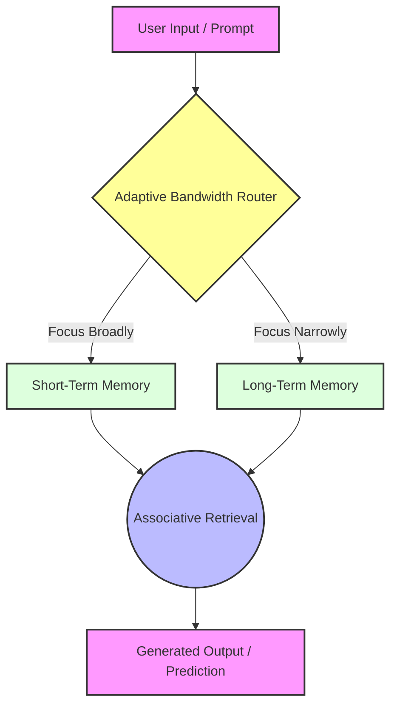

Imagine you want to teach a new employee how to do a specific task.

The current way we train AI is like handing that employee a massive, million-page manual and saying, *"Memorize this, and you'll be able to do the job."* This is how today's AI models, called **Transformers** (the technology behind ChatGPT and Gemini), learn. They are incredibly powerful, but they are also incredibly "thirsty"—they need to consume trillions of words to learn new things.

But what if that employee could learn a new task just by watching you do it once?

That is the promise of a new research paper called **"Memory Mosaics at scale"** by researchers at Meta and New York University. They have built a new type of AI that can learn new tasks on the fly and, amazingly, a smaller version of it can outperform a massive, standard AI trained on **8 times more data**.

Let's break down this fascinating research in simple terms.

## 🧠 The Problem: Transformers Are Data-Hungry Monsters

The AI behind ChatGPT is built on an architecture called the **Transformer**. It's incredibly powerful, but it has a major downside: it's a **data-hungry monster**. To learn how to do something new, it needs to be trained on massive amounts of text—often **trillions** of words.

**Simple Analogy:** Think of a Transformer as a student who can ace a test but only after reading the entire library. If you give them a new book, they have to read the whole thing to answer a question about it.

Researchers have long wanted an AI that could learn "in-context"—that is, learn a new task on the fly, just from a few examples in the prompt, without needing to re-read the whole internet. The problem was, no one had proven a different architecture could achieve this at the same massive scale as Transformers.

## 👥 Who Are the Researchers?

The research was led by **Jianyu Zhang** (New York University and Meta's Fundamental AI Research, FAIR) and **Léon Bottou** (FAIR, Meta, and NYU). Léon Bottou is a highly respected AI scientist, so this work carries significant weight in the AI community.

## 📄 Is It Just a Paper, or Is There Concrete Code?

**It's both.** This is a research paper, but the researchers also released the code on GitHub so other developers and researchers can test, use, and build upon their work.

*   **Read the Research Paper:** [https://arxiv.org/abs/2507.03285](https://arxiv.org/abs/2507.03285)
    
*   **Check out the Code:** [https://github.com/facebookresearch/MemoryMosaics](https://github.com/facebookresearch/MemoryMosaics)
    

## 🔬 What They Did and Found

The researchers took an alternative AI architecture called **Memory Mosaics** and scaled it up for the first time.

**What are Memory Mosaics?** Instead of using "attention" like Transformers (which looks at everything at once), Memory Mosaics use a network of **associative memories**. Think of it as a set of filing cabinets where you store key-value pairs. You give it a "key" (a question), and it retrieves the "value" (the answer).

They built a **10-billion-parameter** version (roughly the size of Meta's LLaMA-8B model) and trained it on **1 trillion tokens** of real-world text. They then tested it against standard Transformers on three key skills:

1.  **Remembering What It Learned:** The Memory Mosaics matched Transformers. They were just as good at remembering the knowledge from their training data.
    
2.  **Learning New Tasks on the Fly (In-Context Learning):** This is where the results were stunning. The Memory Mosaics **significantly outperformed** Transformers at learning a new task from just a few examples in the prompt.
    
3.  **Efficiency – The Big Surprise:** This is the most important finding. A Memory Mosaic trained on just **1 trillion tokens** performed **better** at new tasks than a Transformer trained on **8 trillion tokens**.
    

**Simple Analogy:** It's like a student (Memory Mosaic) who read **1 book** and can solve a new problem better than a student (Transformer) who read **8 books**. The Memory Mosaic is simply a more efficient learner.

## 🔧 How They Improved the Existing Method

The original Memory Mosaics were tested only on small, synthetic data. To scale them up, the researchers introduced **"Memory Mosaics v2"** with key architectural improvements:

*   **Adaptive Bandwidth:** This acts like a "focus" knob, letting the model decide how broadly or narrowly to search its memories for an answer. This makes it better at handling real-world data, which is messy and varied.
    
*   **Hierarchical Memory:** They split memory into **short-term** and **long-term** components. Short-term memory handles recent information (like the current conversation), while long-term memory stores more permanent knowledge. This is similar to how our brains process information.
    

Here is a simplified visual of how the Memory Mosaics v2 architecture works:

